# 📊 Customer Churn Prediction System
An end-to-end Machine Learning web application built using **Python**, **Scikit-learn** and **Streamlit** to predict customer churn based on customer demographics, account details and subscribed services.

The application provides an interactive interface for entering customer information, predicts the probability of churn using a trained Machine Learning pipeline, generates personalized recommendations, and allows users to download a professional PDF report.

# 🚀 Project Overview
Customer Churn is one of the major challenges faced by subscription-based businesses. Predicting customers who are likely to leave helps companies take preventive actions and improve customer retention.

This project demonstrates an end-to-end Machine Learning workflow, starting from data preprocessing and feature engineering to model deployment using Streamlit. The application offers an easy-to-use interface for users to input customer information and instantly recieve churn predictions along with confidence scores and recommendations.

## ✨Features
- ✅ Interactive Streamlit web application
- ✅ User-Friendly Customer Input Form
- ✅ Real-Time Churn Prediction
- ✅ Confidence Score Display
- ✅ Personalized Customer
Recommendations
- ✅ PDF Report Generation
- ✅ Plotly Data Visualization
- ✅ Machine Learning Pipeline Integration
- ✅ Input Validation & Error Handling

## 🎯 Skills Demontrated
- Supervised Machine Learning
- Data Preprocessing
- Feature Selection
- Model Deployment
- Streamlit Deployment
- Data Visualization
- Git & GitHub
- Report Generation
- Project Documentation

## 🛠️ Technologies Used
### Programming Language
- Python

### Machine Learning
- Scikit-learn
- Imbalanced-learn (SMOTE)

### Data Processing
- Pandas
- NumPy

### Web Application
- Streamlit

### Data Visualization
- Plotly

### Report Generation
- ReportLab

### Model Serialization
- Joblib

### Version Control
- Git
- GitHub

## 📂 Dataset
This project uses the **Telco Customer Churn Dataset**, which contains customer demographic details, account information, subscribed services, and billing information.

### Input Features

- Gender
- Senior Citizen
- Partner
- Dependents
- Tenure
- Phone Service
- Multiple Lines
- Internet Service
- Online Security
- Online Backup
- Device Protection
- Tech Support
- Streaming TV
- Streaming Movies
- Contract
- Paperless Billing
- Payment Method
- Monthly Charges
- Total Charges

### Target Variable

- Churn (Yes / No)

## 🤖 Machine Learning Pipeline
The prediction system is built using a complete Scikit-learn pipeline that performs preprocessing and prediction in a single workflow.

Pipeline Components:

- Data Preprocessing
- One-Hot Encoding
- Feature Scaling
- SMOTE (Handling Class Imbalance)
- Feature Selection
- Random Forest Classifier

The trained pipeline is saved using **Joblib**, allowing the application to load the model and make predictions without retraining.

## 📷 Application Preview
The following screenshots demonstrate different stages of the application workflow.

### 🏠 Home Page

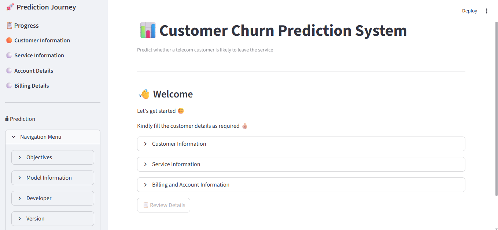

---

### 📝 Customer Details Form

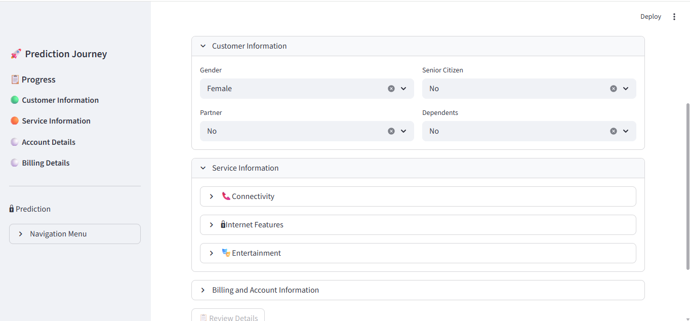
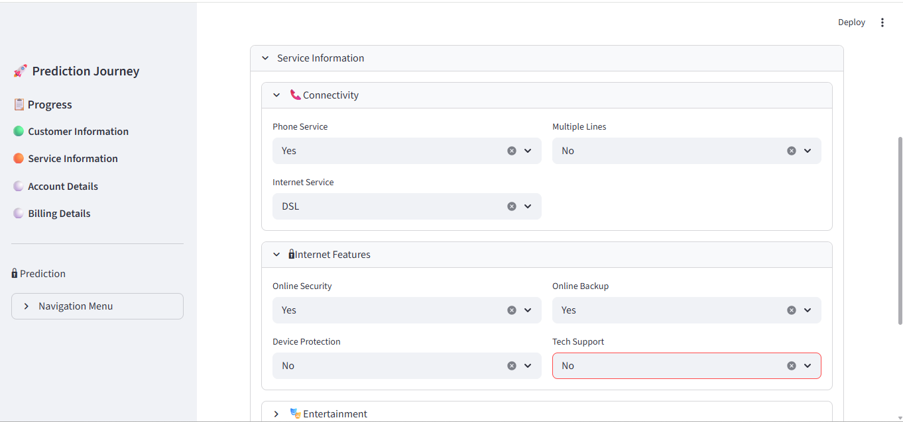
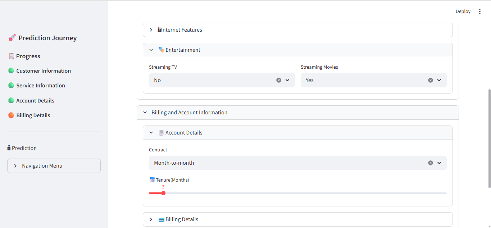
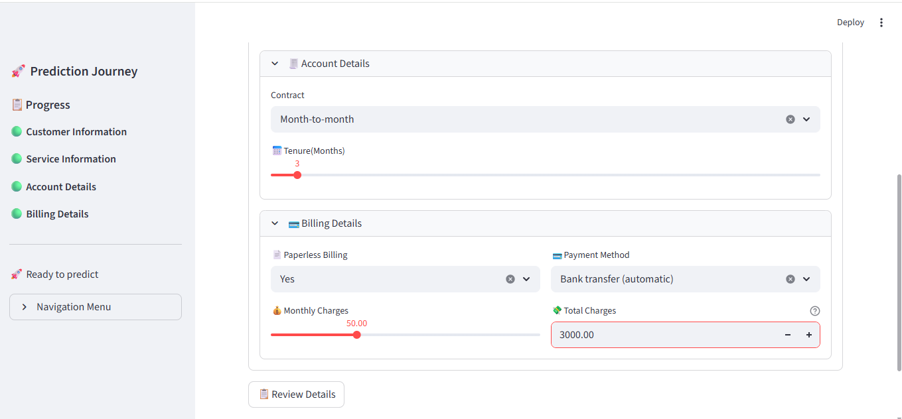

---

### 👀 Review Page

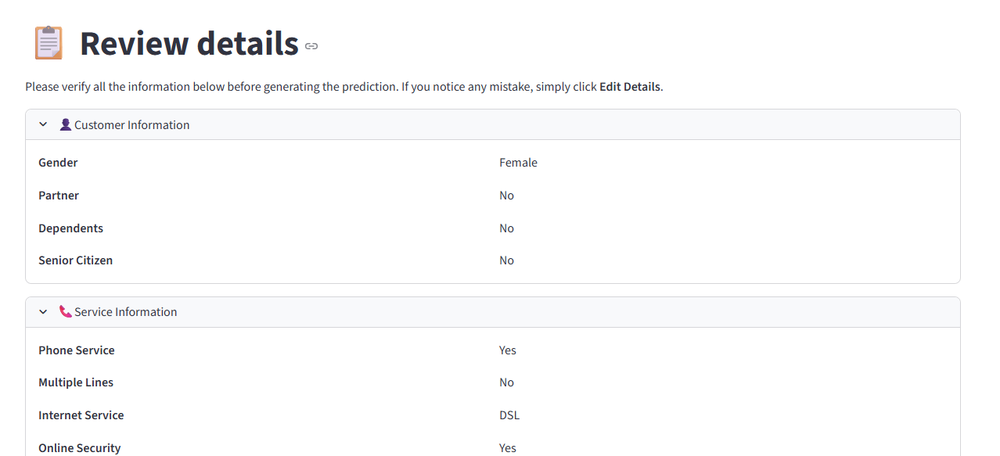
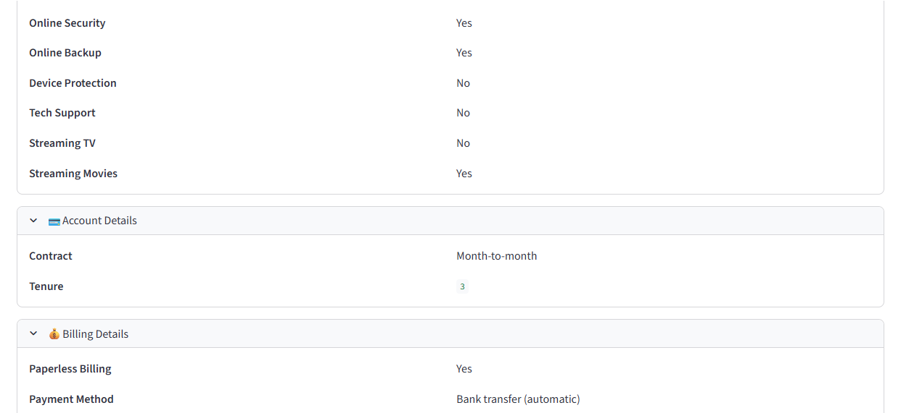
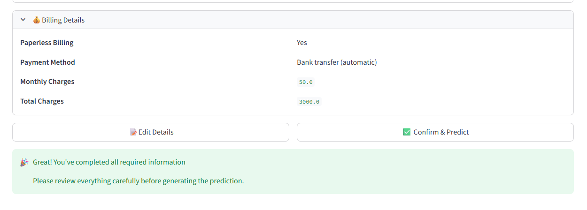

---

### ⚙️ Prediction Engine

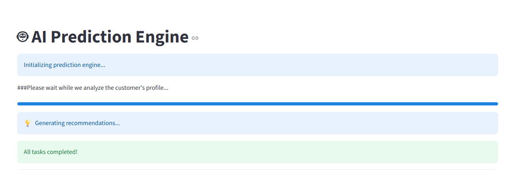

---

### 📊 Prediction Result

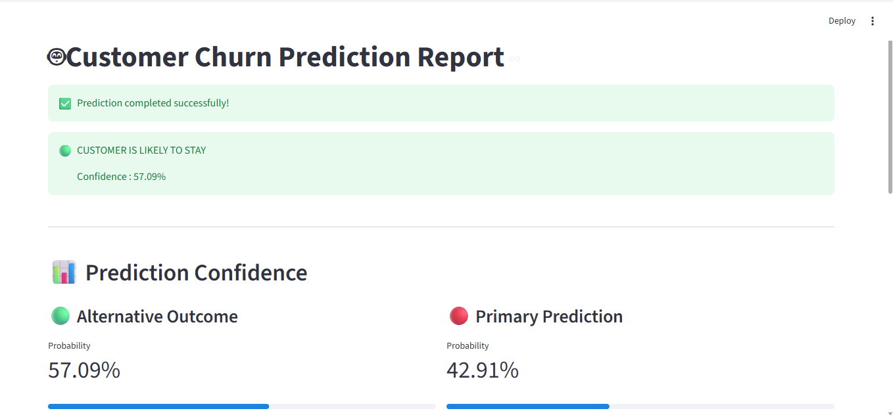
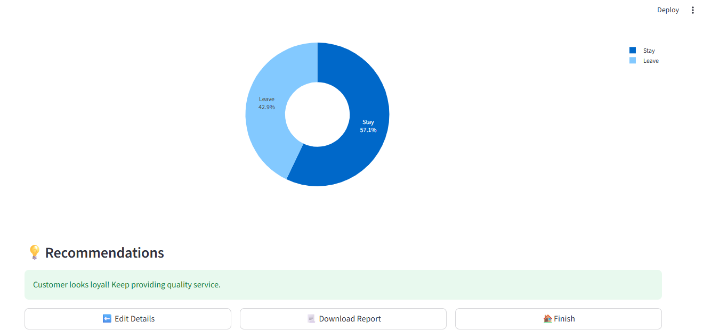

---

### 📄 Generated PDF Report

[📩 View Sample Report](sample_reports/Customer_Churn_Report.pdf)
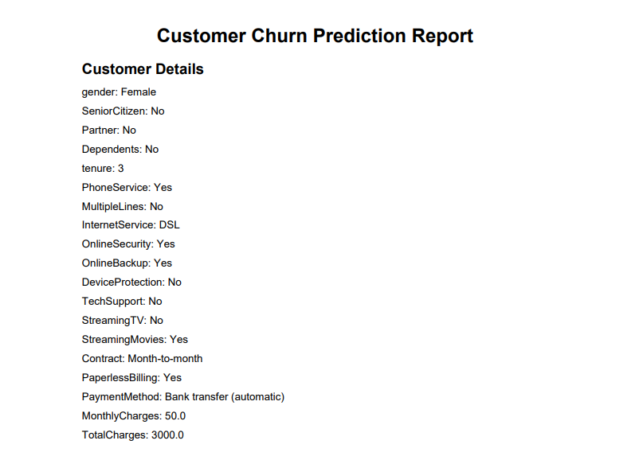

## 📁 Project Structure

```
Customer-Churn-Prediction-System/
│
├── app.py
├── README.md
├── requirements.txt
│
├── data/
│   └── Telco-Customer-Churn.csv
│
├── models/
│   └── customer_churn_pipeline.pkl
│
├── notebooks/
│   └── Customer Churn Detection.ipynb
│
├── utils/
│   └── pdf_generator.py
│
└── images/
    └── (Application Screenshots)
```

## ⚙️ Installation
Clone the repository:

```bash
git clone https://github.com/Dhruv-Mathur65/Customer-Churn-Prediction-System.git
```

Navigate to the project folder:

```bash
cd Customer-Churn-Prediction-System
```

Install the required dependencies:

```bash
pip install -r requirements.txt
```

Run the Streamlit application:

```bash
streamlit run app.py
```
## 🚀 Future Scope
Some planned improvements for future versions include:

- Explainable AI using SHAP
- Customer Login & Authentication
- Database Integration
- Cloud Deployment
- Model Comparison Dashboard
- REST API Support
- Improved Interactive Visualizations
- Enhanced Recommendation System

## 👨‍💻 Author
**Dhruv Mathur**

B.Tech Computer Science & Engineering

Passout Year: **2026**

GitHub:
https://github.com/Dhruv-Mathur05

## 🙏 Acknowledgements
This project was developed as a learning project to strengthen practical knowledge in Machine Learning, Data Analysis, Model Deployment, and Software Development.

Special thanks to the open-source community and the libraries that made this project possible.

## ⭐ Support
If you found this project useful or interesting, please consider giving this repository a ⭐ on GitHub.

Your support is greatly appreciated!
